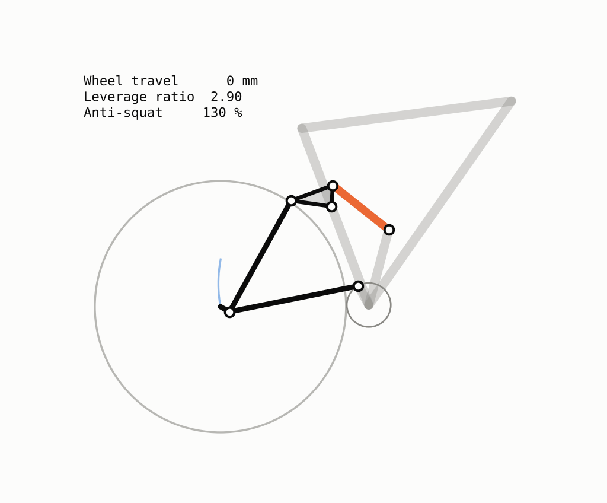
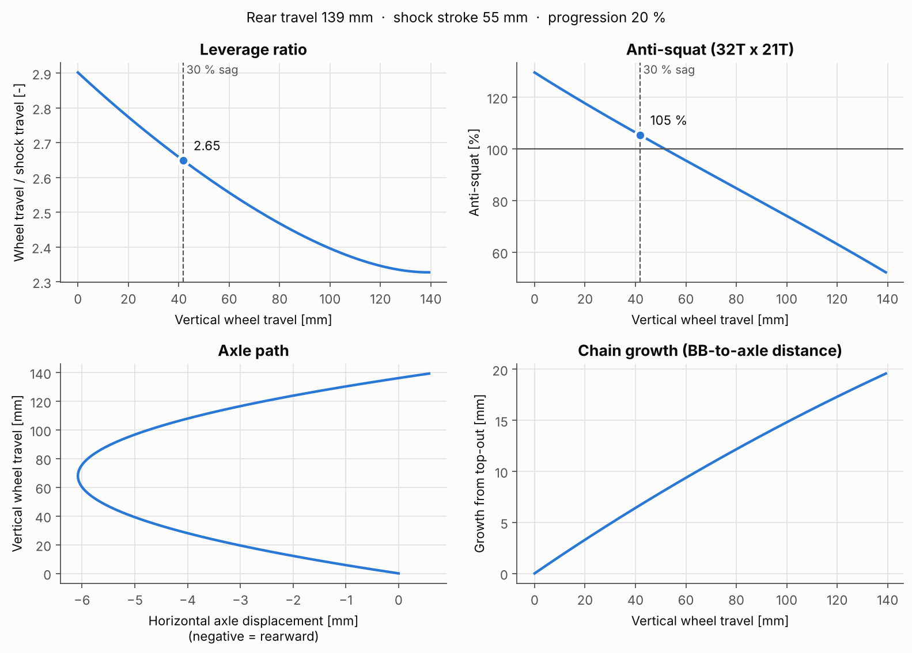
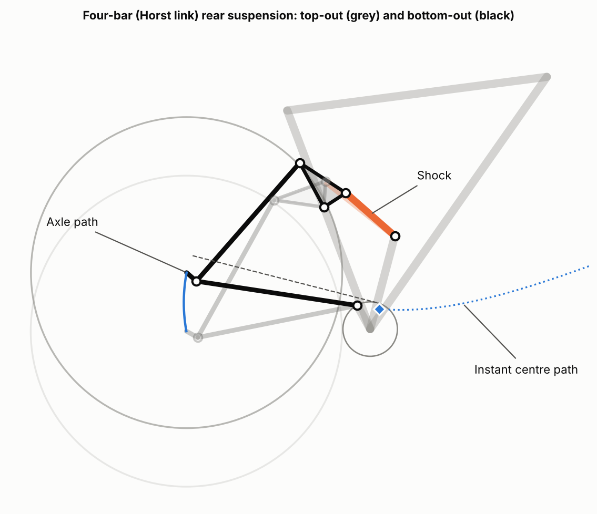

# Bike Suspension Kinematics

Planar kinematic analysis of a **four-bar (Horst link) mountain-bike rear suspension**, written in Python.

Given the pivot locations of a frame, the model solves the linkage over the full shock stroke and computes the characteristics a frame designer looks at: **axle path, leverage ratio, progression, instant centre migration, anti-squat and chain growth**.

<p align="center">
  
</p>

## Results for the example geometry

The example is a fictional 29" trail bike with a 210 × 55 mm shock (`geometries/trail_29_horst_link.json`).

| Quantity | Value |
|---|---|
| Rear wheel travel | 139 mm |
| Mean leverage ratio | 2.53 |
| Leverage ratio (top-out → bottom-out) | 2.90 → 2.33 |
| Progression | 20 % |
| Anti-squat at 30 % sag (32T × 21T) | 105 % |
| Max. rearward axle shift | 6 mm |





## How the model works

**Topology.** The frame is the ground link. The chainstay pivots on the frame at the main pivot *A* and joins the seatstay at the Horst pivot *B*. The rocker pivots on the frame at *D* and joins the seatstay at *C*. The rear axle is fixed to the seatstay, which is the coupler of the four-bar *A-B-C-D*. The shock connects a frame mount *E* to the rocker at *F*.

**Position analysis.** The rocker angle θ is the independent coordinate. For each θ, *C* and *F* follow from a rotation about *D*. *B* is the intersection of two circles (centre *A*, radius *AB*; centre *C*, radius *BC*), and the correct assembly branch is tracked from one step to the next. The axle position follows from the rigid-body rotation of the seatstay. The sweep runs from top-out to the rocker angle at which the shock has used its full stroke, found with a root finder.

**Velocity analysis.** The leverage ratio is computed exactly, without numerical differentiation. For a unit rocker angular velocity, the velocity loop equation

$$\omega_{cs}\,\mathbf{k}\times\overline{AB} \;=\; \omega_{r}\,\mathbf{k}\times\overline{DC} + \omega_{ss}\,\mathbf{k}\times\overline{CB}$$

is a 2 × 2 linear system in the chainstay and seatstay angular velocities. The leverage ratio is then the vertical axle velocity divided by the shock compression rate:

$$LR = \frac{\dot{y}_{axle}}{-\dot{L}_{shock}}$$

**Instant centre.** The instant centre of the seatstay relative to the frame is the intersection of lines *AB* and *DC*.

**Anti-squat.** It is computed with the usual graphical construction:

1. Intersect the upper chain run with the line through the rear axle and the instant centre.
2. Draw a line from the rear contact patch through that point.
3. Anti-squat is the height of that line above the front contact patch, divided by the centre-of-mass height.

The chain run is the exact external tangent of the chainring and the cog.

### Verification

`tests/test_kinematics.py` checks the model against independent conditions:

- Link lengths stay constant over the whole travel, to 1e-9 mm.
- The shock uses exactly its rated stroke.
- The analytic leverage ratio matches finite differences of the position solution.
- The seatstay point located at the instant centre has zero velocity.
- Moving the axle onto the Horst pivot turns the bike into a single pivot, and the axle path becomes a circle about the main pivot.
- The computed chain line is tangent to both sprockets.

## Usage

```bash
pip install -r requirements.txt
python run_analysis.py                                    # example geometry
python run_analysis.py geometries/my_bike.json --out my_results
python tests/test_kinematics.py                           # run the checks
```

To analyse another frame, copy the JSON file and change the hard points. Coordinates are in mm, with the origin at the bottom bracket, x pointing forward and y pointing up, and the points are taken at top-out. The script prints a summary and writes `results.csv` together with the figures and the animation.

## Project structure

```
├── geometries/              # bike definitions (JSON)
├── suspension/
│   ├── geometry.py          # hard points, shock, drivetrain, link lengths
│   ├── kinematics.py        # position & velocity analysis of the four-bar
│   ├── analysis.py          # leverage ratio, anti-squat, instant centre, chain growth
│   └── plotting.py          # figures and animation
├── tests/                   # verification tests
├── results/                 # output of the example
└── run_analysis.py          # command-line entry point
```

## Assumptions and limitations

- Planar, rigid-body model with ideal pin joints. Compliance and bearing play are ignored.
- The frame is held fixed. Fork sag and frame pitch are not modelled, so anti-squat is given relative to the static frame attitude, as most linkage-design tools do.
- Anti-squat is evaluated for one gear combination (32T × 21T). Smaller cogs raise the chain line and change the result.
- The example geometry is generic and does not represent any commercial frame.

## Possible extensions

- Pedal kickback and anti-rise (braking).
- Shock force curve: coil vs. air spring, and the resulting wheel rate.
- Optimisation of pivot locations for a target leverage curve.
- Other layouts: single pivot, VPP/DW-link, linkage-driven single pivot.

## Author

**Oscar García Alonso** — MSc student in Industrial Engineering (Mechanical), Universitat Politècnica de València.
[LinkedIn](https://www.linkedin.com/in/oscargarc%C3%ADaalonso/)

Released under the MIT License.
